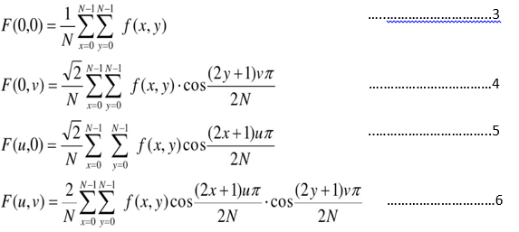

# 相似照片算法功能总结
## 1.相似照片判定

度量两张图片的相似度有许多算法，下面要介绍的是工程领域中最常用的图片相似度算法之一**——Hash算法**。

Hash算法准确的说有三种，分别为**平均哈希算法(aHash)、感知哈希算法(pHash)和差异哈哈希算法(dHash)**。

三种Hash算法都是通过获取图片的hash值，再比较两张图片hash值的 **汉明距离** 来度量两张图片是否相似。两张图片越相似，那么两张图片的hash数的汉明距离越小。下面本文将分别介绍一下这三种Hash算法。

#### 1 平均哈希算法（aHash）
##### 1.1 算法步骤
       平均哈希算法是三种Hash算法中最简单的一种，它通过下面几个步骤来获得图片的Hash值，这几个步骤分别是 **(1) 缩放图片；（2）转灰度图; (3) 算像素均值；（4）根据相似均值计算指纹。** 具体算法如下所示:

##### aHash得到图片Hash值地算法

|步骤|具体内容|
|--------|:-----|
|缩放图片	|输入图片大小尺寸各异，为了统一图片的输入，统一将图片尺寸缩放为8*8，一共得到了64个像素点。|
|转灰度图	|输入图片有些为单通道灰度图，有些RGB三通道彩色图，有些为RGBA四通道彩色图。也为了统一下一步输入标准，将非单通道图片都转为单通道灰度图。 其中RGB三通道转单通道算法有下面几种:   1.浮点算法：Gray=R0.3+G0.59+B0.11;   2.整数方法：Gray=(R30+G59+B11)/100;   3.移位方法：Gray =(R76+G151+B*28)>>8;   4.平均值法：Gray=（R+G+B）/3;   5.仅取绿色：Gray=G;|
|算像素均值|	通过上一步可得一个8x8的整数矩阵G，计算这个矩阵中所有元素的平均值，假设其值为a|
|据像素均值计算指纹	|初始化输入图片的ahash = ""    从左到右一行一行地遍历矩阵G每一个像素如果第i行j列元素G(i,j) >= a，则ahash += "1"如果第i行j列元素G(i,j) <a， 则ahash += "0"得到图片的ahash值后，比较两张图片ahash值的汉明距离，通常认为汉明距离小于10的一组图片为相似图片。|

  得到图片的ahash值后，比较两张图片ahash值的汉明距离，通常认为[汉明距离](https://baike.baidu.com/item/%E6%B1%89%E6%98%8E%E8%B7%9D%E7%A6%BB)小于10的一组图片为相似图片。

##### 以下面这张图为例，以图片实例体现过程：    

       
    
  

上图为原图;

           
        
  

上图为转为8x8尺寸的Lena图;   

                   
                
  

上图为转为灰度8x8尺寸的Lena图;  

其中转为8x8尺寸的Lena对应的数据矩阵为:

 

                    
                 
  

很容得到如上矩阵 **所有元素的均值a= 121.328125** , 将上述矩阵中大于或等于a的元素置为1, 小于a的元素置为0，可得：

 

                    
                 
  

 所以可得Lena图的aHash为：

***1011111010011110100111011010100110101011101000110000111000101100***

将二进制形式ahash转十六进制hash为：

***be9e9da9aba30e2c***

**为了测试aHash算法的效果，我们用一张带噪声Lena(noise)图和与Lena不一样的Barbara做图片相似度对比实验，其中Lena(noise)和Barbara如下:**

                   
                
  

上图为Lena(noise)图;  

                   
                
  

上图为Barbara图;  

 **通过aHash算法容易得三个图片的hash值，然后根据hanming距离计算Lena(origin).png和Lena(noise).png Barbar.png之间汉明距离，具体如下:**

                   
                
  

以上为aHash算法的实现流程。

#### 2 感知哈希算法（pHash）

##### 2.1 算法步骤
感知哈希算法是三种Hash算法中较为复杂的一种，它是基于DCT（离散余弦变换）来得到图片的hash值，其算法几个步骤分别是：**(1) 缩放图片；（2）转灰度图; (3) 计算DCT；（4）缩小DCT; (5)算平均值；(6) 计算指纹。** 具体算法如下所示:

表2 pHash得到图片Hash值地算法

|步骤	|具体内容|
|--------|:-----|
|缩放图片|	统一将图片尺寸缩放为32*32，一共得到了1024个像素点。|
|转灰度图|	统一下一步输入标准，将非单通道图片都转为单通道灰度图。|
|计算DCT|	计算32x32数据矩阵的离散余弦变换后对应的32x32数据矩阵|
|缩小DCT	|取上一步得到32x32数据矩阵左上角8x8子区域|
|算平均值	|通过上一步可得一个8x8的整数矩阵G, 计算这个矩阵中所有元素的平均值，假设其值为a|
|计算指纹	|初始化输入图片的phash = ""，  从左到右一行一行地遍历矩阵G每一个像素，   如果第i行j列元素G(i,j) >= a，则phash += "1"   如果第i行j列元素G(i,j) <a， 则phash += "0"|

得到图片的phash值后，比较两张图片phash值的汉明距离，通常认为汉明距离小于10的一组图片为相似图片。

##### 2.2 具体实例
仍用之前的图来说明.

                   
                
  
转为灰度32x32尺寸的Lena图  

                   
                
  
灰度32x32尺寸Lena图对应的DCT矩阵  

通过计算可得灰度32x32Lenna图对应的DCT矩阵左上角8x8区域子矩阵为:

                 
                
  
很容得到如上矩阵所有元素的均值a= 77.35, 将上述矩阵中大于或等于a的元素置为1, 小于a的元素置为0，可得：

                 
                
   
所以可得Lena图的pHash为:  

**1001100111000100010101000010010101100000001000111000001010000000**  

将二进制形式phash转十六进制hash为:  

**99c4542560238280**  

为了测试pHash算法的效果，同样用一张带噪声Lena(noise)图和与Lena不一样的Barbara做图片相似度对比实验。通过pHash算法容易得三个图片的hash值，然后根据hanming距离计算Lena(origin).png和Lena(noise).png Barbar.png之间汉明距离，具体如下:

                 
                
  
以上为pHash算法的实现流程。  

------------------------------------

上面总结了在项目中用到的2种图片识别的Hash算法。第三种dHash算法可以点击此链接了解。  
[以上内容大多数转载自此。](https://www.cnblogs.com/Kalafinaian/p/11260808.html)

### 2.离散余弦变换（DCT）

 [**一.它是什么?(附带wiki链接)**](https://zh.wikipedia.org/wiki/%E7%A6%BB%E6%95%A3%E4%BD%99%E5%BC%A6%E5%8F%98%E6%8D%A2)  
离散余弦变换(Discrete Cosine Transform)本质上也是离散傅里叶变换(Discrete Fourier Transform)，但是只有实数部分。**（以下简称DCT）**  

**二.为什么它会出现在这里？**  
DCT可以就是将二维图像从空间域转换到频率域，形象的说，就是计算出图像由哪些二维余弦波构成，计算出的结果为c(u ,v), 其中u为二维波的水平方向频率，v为二维波的垂直方向频率； 最终会计算出很多的c(u,v) ; 每一个c称为一个DCT系数，代表的是频率为(u,v)的二维波的振幅（或者能量），所有这些二维波的叠加就是那个原始的图片。  

**三.怎么用？**  

**二维离散余弦变换可由下列表达式表示:**  

这是是二维离散余弦变换的正变换公式，其中f(x,y)是空间域一个N*N的二维向量元素，即一个N*N的矩阵，x,y = 0,1,2，…，N-1;F(U,V)是经计算后得到的变换域矩阵，u,v = 0,1,2，….，N-1.求和可分性是二维离散余弦变换的一个重要特征，因此我们可以用下式表示：  

由一维和二维的离散余弦变换公式性质可以推导得到二维离散余弦变换也可以写成矩阵相乘形式

 A为一维离散余弦变换的变换系数矩阵，AT是A的转置矩阵

对图像进行二维离散余弦变换（2D-DCT）的步骤：

 **1.获得图像的二维数据矩阵f(x,y)；**

 **2.求离散余弦变换的系数矩阵A；**

 **3.求系数矩阵对应的转置矩阵AT；**

** 4.根据公式F=A[f(x,y)]AT计算离散余弦变换;**

这便是DCT在图像信号处理中的使用方式。结合上方DCT在pHash算法中的使用过程，我们不难发现，很多图像相关功能都少不了它。

**四.使用时的难点在哪？**

傅立叶变换是计算机，网络，通信领域的基石。
------------------------------------

### 3.
